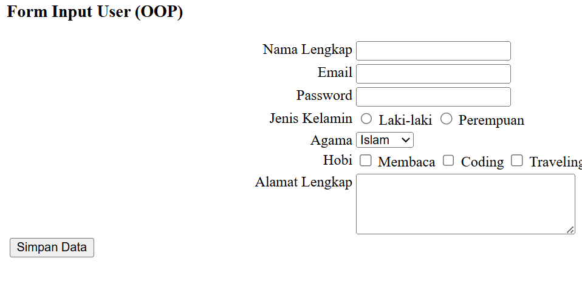
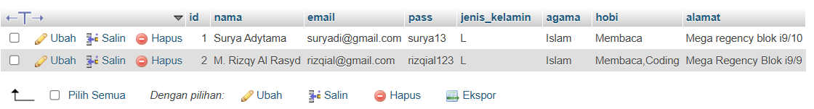
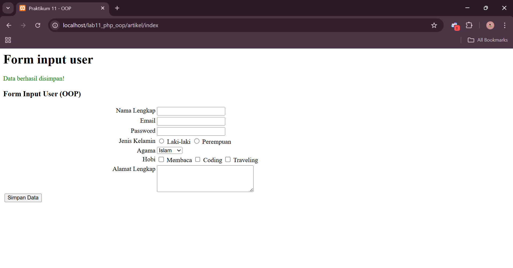

# lab11web

```
Nama  : M. Rizqy Al Rasyd
Nim   : 312410424
Kelas : TI.24.A3
```
## Program input user

## form.php
Code:
```
<?php
class Form
{
    private $fields = array();
    private $action;
    private $submit = "Submit Form";
    private $jumField = 0;

    public function __construct($action, $submit)
    {
        $this->action = $action;
        $this->submit = $submit;
    }

    public function displayForm()
    {
        echo "<form action='" . $this->action . "' method='POST'>";
        echo '<table width="100%" border="0">';

        foreach ($this->fields as $field) {
            echo "<tr><td align='right' valign='top'>" . $field['label'] . "</td>";
            echo "<td>";

            switch ($field['type']) {
                case 'textarea':
                    echo "<textarea name='" . $field['name'] . "' cols='30' rows='4'></textarea>";
                    break;

                case 'select':
                    echo "<select name='" . $field['name'] . "'>";
                    foreach ($field['options'] as $value => $label) {
                        echo "<option value='" . $value . "'>" . $label . "</option>";
                    }
                    echo "</select>";
                    break;

                case 'radio':
                    foreach ($field['options'] as $value => $label) {
                        echo "<label><input type='radio' name='" . $field['name'] . "' value='" . $value . "'> " . $label . "</label> ";
                    }
                    break;

                case 'checkbox':
                    foreach ($field['options'] as $value => $label) {
                        echo "<label><input type='checkbox' name='" . $field['name'] . "[]' value='" . $value . "'> " . $label . "</label> ";
                    }
                    break;

                case 'password':
                    echo "<input type='password' name='" . $field['name'] . "'>";
                    break;

                default:
                    echo "<input type='text' name='" . $field['name'] . "'>";
                    break;
            }

            echo "</td></tr>";
        }

        echo "<tr><td colspan='2'>";
        echo "<input type='submit' value='" . $this->submit . "'></td></tr>";
        echo "</table>";
        echo "</form>";
    }

    public function addField($name, $label, $type = "text", $options = array())
    {
        $this->fields[$this->jumField]['name'] = $name;
        $this->fields[$this->jumField]['label'] = $label;
        $this->fields[$this->jumField]['type'] = $type;
        $this->fields[$this->jumField]['options'] = $options;
        $this->jumField++;
    }
}
?>
```
Fungsi : untuk membuat form input seperti text, textarea, checkbox, radio.

## database.php
Code:
```
<?php
class Database
{
    protected $host;
    protected $user;
    protected $password;
    protected $db_name;
    protected $conn;

    public function __construct()
    {
        $this->getConfig();
        $this->conn = new mysqli($this->host, $this->user, $this->password, $this->db_name);
        if ($this->conn->connect_error) {
            die("Connection failed: " . $this->conn->connect_error);
        }
    }

    private function getConfig()
    {
        include("config.php");
        $this->host = $config['host'];
        $this->user = $config['username'];
        $this->password = $config['password'];
        $this->db_name = $config['db_name'];
    }

    public function query($sql)
    {
        return $this->conn->query($sql);
    }

    public function get($table, $where = null)
    {
        if ($where) {
            $where = " WHERE " . $where;
        }
        $sql = "SELECT * FROM " . $table . $where;
        $sql = $this->conn->query($sql);
        $sql = $sql->fetch_assoc();
        return $sql;
    }

    public function insert($table, $data)
    {
        if (is_array($data)) {
            foreach ($data as $key => $val) {
                $column[] = $key;
                $value[] = "'{$val}'";
            }
            $columns = implode(",", $column);
            $values = implode(",", $value);
        }

        $sql = "INSERT INTO " . $table . " (" . $columns . ") VALUES (" . $values . ")";
        $sql = $this->conn->query($sql);

        if ($sql == true) {
            return $sql;
        } else {
            return false;
        }
    }

    public function update($table, $data, $where)
    {
        $update_value = [];
        if (is_array($data)) {
            foreach ($data as $key => $val) {
                $update_value[] = "$key='{$val}'";
            }
            $update_value = implode(",", $update_value);
        }

        $sql = "UPDATE " . $table . " SET " . $update_value . " WHERE " . $where;
        $sql = $this->conn->query($sql);

        if ($sql == true) {
            return true;
        } else {
            return false;
        }
    }
}
?>
```
Fungsi : Untuk menyimpan dan mengkoneksikan kedalam mysql/phpmyadmin

## config.php
Code:
```
<?php
// config.php (di root project)
$config = [
    'host'     => 'localhost',
    'username' => 'root',
    'password' => '',
    'db_name'  => 'lab11_php_oop'
];
```
## implementasi di dalal index.php
Code:
```
<?php
$db = new Database();
$form = new Form("", "Simpan Data");

if ($_POST) {
    $data = [
        'nama' => $_POST['nama'],
        'email' => $_POST['email'],
        'pass' => $_POST['pass'],
        'jenis_kelamin' => $_POST['jenis_kelamin'],
        'agama' => $_POST['agama'],
        'hobi' => implode(",", $_POST['hobi']),
        'alamat' => $_POST['alamat'],
    ];

    $simpan = $db->insert('users', $data);

    if ($simpan) {
        echo "<div style='color:green'>Data berhasil disimpan!</div>";
    } else {
        echo "<div style='color:red'>Gagal menyimpan data.</div>";
    }
}
?>
<!DOCTYPE html>
<html>
<head>
<title>Praktikum 11 - OOP</title>
</head>
<body>
<h3>Form Input User (OOP)</h3>
<?php
$form->addField("nama", "Nama Lengkap");
$form->addField("email", "Email");
$form->addField("pass", "Password", "password");
$form->addField("jenis_kelamin", "Jenis Kelamin", "radio", [
    'L' => 'Laki-laki',
    'P' => 'Perempuan'
]);
$form->addField("agama", "Agama", "select", [
    'Islam' => 'Islam',
    'Kristen' => 'Kristen',
    'Katolik' => 'Katolik',
    'Hindu' => 'Hindu',
    'Budha' => 'Budha'
]);
$form->addField("hobi", "Hobi", "checkbox", [
    'Membaca' => 'Membaca',
    'Coding' => 'Coding',
    'Traveling' => 'Traveling'
]);
$form->addField("alamat", "Alamat Lengkap", "textarea");
$form->displayForm();
?>
</body>
</html>
```
Output:


## .htaccess
Code:
```
<IfModule mod_rewrite.c>
    RewriteEngine On
    RewriteBase /lab11_php_oop/
    RewriteCond %{REQUEST_FILENAME} !-d
    RewriteCond %{REQUEST_FILENAME} !-f
    RewriteRule ^(.*)$ index.php/$1 [L]
</IfModule>
```

## users pada mysql
Code:
```
CREATE TABLE users (
  id INT AUTO_INCREMENT PRIMARY KEY,
  nama VARCHAR(100),
  email VARCHAR(100),
  pass VARCHAR(100),
  jenis_kelamin VARCHAR(20),
  agama VARCHAR(50),
  hobi TEXT,
  alamat TEXT
);
```
Output:


## Hasil dari form input oop



